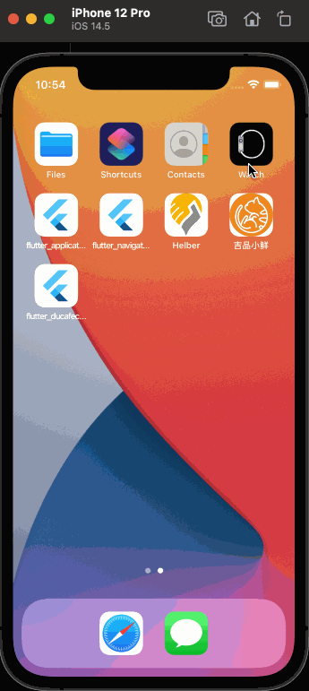
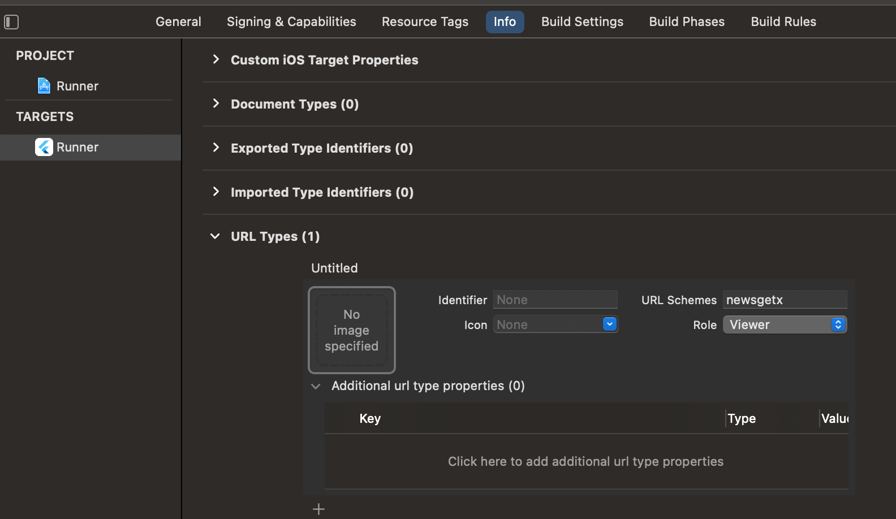
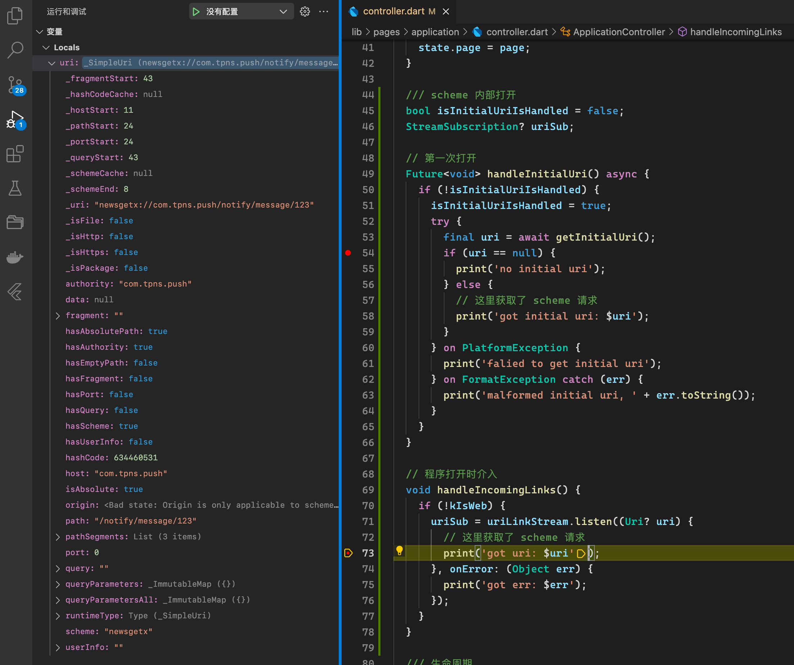

# flutter_ducafecat_news_getx

新闻客户端 Getx 版本 - 项目模板

> 你以为看到了结果，其实一切只是刚刚开始！


## B 站视频

https://space.bilibili.com/404904528/channel/detail?cid=177514&ctype=0

## 微信群 ducafecat

## 前言

我的这个代码主要不是为了完成业务，大家也看到了并没有很多业务。

这个项目是一个模板，有的同学可能要问，模板干啥的么~

## 如何提高代码质量+效率？


### 1. 规范

用习惯的方式去开发所有的项目，如：编码规范、目录规则、模型定义、布局方案。。。

[Effective Dart: Style](https://dart.dev/guides/language/effective-dart/style)

[Flutter_Go 代码开发规范.md](https://github.com/alibaba/flutter-go/blob/master/Flutter_Go%20%E4%BB%A3%E7%A0%81%E5%BC%80%E5%8F%91%E8%A7%84%E8%8C%83.md)

### 2. 模板

共性通用、常见的东西抽取出来，如：路由、全局数据、认证、鉴权、离线登录、接口管理、数据模型、程序升级、数据验证、三级缓存、错误收集、行为分析。。。

### 3. 代码库

这就是业务功能了，你可以都集中在一个单体的项目中（推荐），而不是很多包，不好管理。

常见业务有：欢迎界面、注册、登录、三方登录、聊天、视频、拍照、SKU、购物车、分销、地图、消息推送、评论、瀑布流、分类订阅、属性表格、轮播。。。

## 配套 vscode 插件

- [GetX Snippets](https://marketplace.visualstudio.com/items?itemName=get-snippets.get-snippets)

  必装 代码提示、代码块

- [Json to Dart Model](https://marketplace.visualstudio.com/items?itemName=hirantha.json-to-dart)

  支持空安全，推荐

- [Flutter GetX Generator - 猫哥](https://marketplace.visualstudio.com/items?itemName=ducafecat.getx-template)

  这个插件用来快速创建 `page` 代码，计划（json to dart、iconfont、test unit）

## 参考

- [get_cli](https://github.com/jonataslaw/get_cli)
- [getx_pattern](https://kauemurakami.github.io/getx_pattern/)
- [flutter-go](https://github.com/alibaba/flutter-go)
- [猫哥新闻第一版 flutter_learn_news](https://github.com/ducafecat/flutter_learn_news)
- [写夜子 flutter-getx-template](https://github.com/xieyezi/flutter-getx-template)
- [猫哥 getx_quick_start](https://github.com/ducafecat/getx_quick_start)
- [flutter_use](https://github.com/CNAD666/flutter_use)
- [redux part-1-overview-concepts](https://redux.js.org/tutorials/essentials/part-1-overview-concepts)
- [todo_getx](https://github.com/loicgeek/todo_getx)

## Mock 数据

- api

https://yapi.ducafecat.tech/mock/11

- 查看接口方式

```
https://yapi.ducafecat.tech
api@ducafecat.tech
123456
```

## 目录结构


还是延续我第一版的目录结构，虽然 getx-cli 的目录也很简洁，但是我这个也没大问题。

### common 通用组件

| 名称        | 说明           |
| ----------- | -------------- |
| apis        | http 接口定义  |
| entities    | 数据模型、实例 |
| langs       | 多语言         |
| middlewares | 中间件         |
| routes      | 路由           |
| services    | getx 全局      |
| utils       | 工具           |
| values      | 值             |
| widgets     | 公共组件       |

### pages 业务界面


界面代码拆分也是继承了 redux 的设计思想，视图、动作、状态，进行拆分。

| 名称            | 说明     |
| --------------- | -------- |
| bindings.dart   | 数据绑定 |
| controller.dart | 控制器   |
| index.dart      | 入口     |
| state.dart      | 状态     |
| view.dart       | 视图     |
| widgets         | 组件     |

## GetX 上下拉列表界面


### `RxList` 来处理 List 集合

lib/pages/category/state.dart

```dart
class CategoryState {
  // 新闻翻页
  RxList<NewsItem> newsList = <NewsItem>[].obs;
}
```

### `StatefulWidget` 结合 `AutomaticKeepAliveClientMixin`

lib/pages/category/widgets/news_page_list.dart

```dart
class _NewsPageListState extends State<NewsPageList>
    with AutomaticKeepAliveClientMixin {
  @override
  bool get wantKeepAlive => true;

  final controller = Get.find<CategoryController>();

```

### `pull_to_refresh` 下拉组件

lib/pages/category/widgets/news_page_list.dart

```dart
  @override
  Widget build(BuildContext context) {
    super.build(context);
    return GetX<CategoryController>(
      init: controller,
      builder: (controller) => SmartRefresher(
        enablePullUp: true,
        controller: controller.refreshController,
        onRefresh: controller.onRefresh,
        onLoading: controller.onLoading,
        child: CustomScrollView(
          slivers: [
            SliverPadding(
              padding: EdgeInsets.symmetric(
                vertical: 0.w,
                horizontal: 0.w,
              ),
              sliver: SliverList(
                delegate: SliverChildBuilderDelegate(
                  (content, index) {
                    var item = controller.state.newsList[index];
                    return newsListItem(item);
                  },
                  childCount: controller.state.newsList.length,
                ),
              ),
            ),
          ],
        ),
      ),
    );
  }
```

`controller: controller.refreshController` 上下拉控制器

`onRefresh: controller.onRefresh` 下拉刷新数据

`onLoading: controller.onLoading` 上拉载入数据

`SliverChildBuilderDelegate` 动态构建每一项, `childCount` 告诉组件一共有多少数据

### `controller` 中写入业务

lib/pages/category/controller.dart

- `onRefresh` 下拉刷新

```dart
  void onRefresh() {
    fetchNewsList(isRefresh: true).then((_) {
      refreshController.refreshCompleted(resetFooterState: true);
    }).catchError((_) {
      refreshController.refreshFailed();
    });
  }
```

`refreshController.refreshCompleted()` 刷新完成

`refreshController.refreshFailed()` 刷新失败

- `onLoading` 上拉载入

```dart
  void onLoading() {
    if (state.newsList.length < total) {
      fetchNewsList().then((_) {
        refreshController.loadComplete();
      }).catchError((_) {
        refreshController.loadFailed();
      });
    } else {
      refreshController.loadNoData();
    }
  }
```

`refreshController.loadComplete()` 载入完成

`refreshController.loadFailed()` 载入失败

`refreshController.loadNoData()` 没有数据

- `fetch` 所有数据

```dart
  // 拉取数据
  Future<void> fetchNewsList({bool isRefresh = false}) async {
    var result = await NewsAPI.newsPageList(
      params: NewsPageListRequestEntity(
        categoryCode: categoryCode,
        pageNum: curPage + 1,
        pageSize: pageSize,
      ),
    );

    if (isRefresh == true) {
      curPage = 1;
      total = result.counts!;
      state.newsList.clear();
    } else {
      curPage++;
    }

    state.newsList.addAll(result.items!);
  }
```

`state.newsList.addAll(result.items!);` 合并 `list` 集合 `RxList` 封装的

- `dispose` 记得释放

```dart
  ///dispose 释放内存
  @override
  void dispose() {
    super.dispose();
    // dispose 释放对象
    refreshController.dispose();
  }
```

`refreshController.dispose()` 这个业务中就是下拉控件了，还有视频播放器、文本框啥的控制器都要记得释放。

- `bindings` 放在 `ApplicationBinding`

lib/pages/application/bindings.dart

```dart
class ApplicationBinding implements Bindings {
  @override
  void dependencies() {
    Get.lazyPut<ApplicationController>(() => ApplicationController());
    Get.lazyPut<MainController>(() => MainController());
    Get.lazyPut<CategoryController>(() => CategoryController());
  }
}
```

因为这个 `CategoryController` 是属于 `Application` 被路由载入的

## 状态管理

### `Bindings` 自动载入释放

适合命名路由

- 定义 `Bindings`

```dart
class SignInBinding implements Bindings {
  @override
  void dependencies() {
    Get.lazyPut<SignInController>(() => SignInController());
  }
}
```

- 路由定义

```dart
GetPage(
  name: AppRoutes.SIGN_IN,
  page: () => SignInPage(),
  binding: SignInBinding(),
),
```

- `Get.toNamed` 载入界面时自动管理响应数据

```sh
flutter: ** GOING TO ROUTE /home. isError: [false]
flutter: ** GOING TO ROUTE /count. isError: [false]
flutter: ** Instance "CountController" has been created. isError: [false]
flutter: ** Instance "CountController" has been initialized. isError: [false]
flutter: ** GOING TO ROUTE /count. isError: [false]
flutter: ** CLOSE TO ROUTE /count. isError: [false]
flutter: ** "CountController" onDelete() called. isError: [false]
flutter: ** "CountController" deleted from memory. isError: [false]
```

### `Get.put` `Get.find` 手动管理

适合非命名路由、组件实例化

- `Get.put` 初始

```dart
class StateDependencyPutFindView extends StatelessWidget {
  StateDependencyPutFindView({Key? key}) : super(key: key);

  final controller = Get.put<CountController>(CountController());
```

- `Get.find` 调用

```dart
class NextPageView extends StatelessWidget {
  NextPageView({Key? key}) : super(key: key);

  final controller = Get.find<CountController>();

  @override
  Widget build(BuildContext context) {
    return Scaffold(
      appBar: AppBar(
        title: Text("NextPage"),
      ),
      body: Center(
        child: Column(
          children: [
            GetX<CountController>(
              init: controller,
              initState: (_) {},
              builder: (_) {
                return Text('value -> ${_.count}');
              },
            ),
            Divider(),
          ],
        ),
      ),
    );
  }
}
```

## 组件设计

### 直接使用 `GetView` 组件

好处代码少，直接用 `controller` 成员变量访问

```dart
class HellowordWidget extends GetView<NotfoundController> {
  @override
  Widget build(BuildContext context) {
    return Center(
      child: Obx(() => Text(controller.state.title)),
    );
  }
}
```

### 遇到 `Mixin` 要自定义

使用 `Mixin with` 特性，直接 `StatefulWidget` `StatelessWidget` 封装

这是不可避免的

- AutomaticKeepAliveClientMixin

```dart
class _NewsPageListState extends State<NewsPageList>
    with AutomaticKeepAliveClientMixin {
  @override
  bool get wantKeepAlive => true;

  final controller = Get.find<CategoryController>();

  @override
  Widget build(BuildContext context) {
    super.build(context);
```

- TickerProviderStateMixin

```dart
class StaggerRoute extends StatefulWidget {
  @override
  _StaggerRouteState createState() => _StaggerRouteState();
}

class _StaggerRouteState extends State<StaggerRoute> with TickerProviderStateMixin {
  final controller = Get.find<StaggerController>();
```

### 不要响应数据过度使用

- 很多时候，你可能不需要响应数据

  - 单页面数据列表
  - 无夸页面、夸组件情况
  - 表单处理

- 推荐使用场景

  - 全局数据: 用户信息、聊天推送、样式色彩主题
  - 单页多组件交互：聊天界面
  - 多页面切换：购物车

> 请分清楚 `GetX` 是一种组件的封装方式，他只是包含了 `路由`、`状态管理`、`弹出框` ...

## Deep Linking 方式外部打开 APP

- 效果



- 参考

  - https://flutter.dev/docs/development/ui/navigation/deep-linking
  - https://developer.android.com/codelabs/basic-android-kotlin-training-activities-intents#0
  - https://developer.android.com/reference/android/content/Intent
  - https://www.runoob.com/w3cnote/android-tutorial-intent-base.html
  - https://pub.flutter-io.cn/packages/uni_links

- android

> android/app/src/main/AndroidManifest.xml

```xml
<activity
  ... >
  ...
    <intent-filter>
        <action android:name="android.intent.action.VIEW"/>
        <category android:name="android.intent.category.DEFAULT"/>
        <category android:name="android.intent.category.BROWSABLE"/>
        <data
            android:scheme="newsgetx"
            />
    </intent-filter>
</activity>
```

- ios

> Runner -> TARGETS -> Info -> URL Types



- 插件 uni_links

```yaml
dependencies:
  ...
  uni_links: ^0.5.1
```

- flutter 代码

> lib/pages/application/controller.dart

```dart

  /// scheme 内部打开
  bool isInitialUriIsHandled = false;
  StreamSubscription? uriSub;

  // 第一次打开
  Future<void> handleInitialUri() async {
    if (!isInitialUriIsHandled) {
      isInitialUriIsHandled = true;
      try {
        final uri = await getInitialUri();
        if (uri == null) {
          print('no initial uri');
        } else {
          // 这里获取了 scheme 请求
          print('got initial uri: $uri');
        }
      } on PlatformException {
        print('falied to get initial uri');
      } on FormatException catch (err) {
        print('malformed initial uri, ' + err.toString());
      }
    }
  }

  // 程序打开时介入
  void handleIncomingLinks() {
    if (!kIsWeb) {
      uriSub = uriLinkStream.listen((Uri? uri) {
        // 这里获取了 scheme 请求
        print('got uri: $uri');

        if (uri != null && uri.path == '/notify/category') {
          Get.toNamed(AppRoutes.Category);
        }
      }, onError: (Object err) {
        print('got err: $err');
      });
    }
  }

  @override
  void dispose() {
    uriSub?.cancel();
    super.dispose();
  }
```

- 网页中调用

```html
<a href="newsgetx://com.tpns.push/notify/category"
  >newsgetx://com.tpns.push/notify/category</a
>

<a href="newsgetx://com.tpns.push/notify/message/123"
  >newsgetx://com.tpns.push/notify/message/123</a
>
```

- 结果



## 路由设计

通过 GetPage 方式声明 名称、组件、数据绑定、中间件

文件

`lib/common/routes/pages.dart`

```dart
class AppRoutes {
  static const INITIAL = '/';
  static const SIGN_IN = '/sign_in';
  static const SIGN_UP = '/sign_up';
  static const NotFound = '/not_found';

  static const Application = '/application';
  static const Category = '/category';
}
```

`lib/common/routes/names.dart`

```dart
class AppPages {
  static const INITIAL = AppRoutes.INITIAL;
  static final RouteObserver<Route> observer = RouteObservers();
  static List<String> history = [];

  static final List<GetPage> routes = [
    // 免登陆
    GetPage(
      name: AppRoutes.INITIAL,
      page: () => WelcomePage(),
      binding: WelcomeBinding(),
      middlewares: [
        RouteWelcomeMiddleware(priority: 1),
      ],
    ),
    ...
```

## 中间件

### 登录验证

通过 继承 `GetMiddleware` 并重写 `redirect` 方法，如果没有登录，指向登录页。

`lib/common/middlewares/router_auth.dart`

```dart
/// 检查是否登录
class RouteAuthMiddleware extends GetMiddleware {
  // priority 数字小优先级高
  @override
  int? priority = 0;

  RouteAuthMiddleware({required this.priority});

  @override
  RouteSettings? redirect(String? route) {
    if (UserStore.to.isLogin ||
        route == AppRoutes.SIGN_IN ||
        route == AppRoutes.SIGN_UP ||
        route == AppRoutes.INITIAL) {
      return null;
    } else {
      Future.delayed(
          Duration(seconds: 1), () => Get.snackbar("提示", "登录过期,请重新登录"));
      return RouteSettings(name: AppRoutes.SIGN_IN);
    }
  }
}
```

### 欢迎屏幕

如果是第一次登录去欢迎屏幕，已登录的去首页，没登录的去登录页。

`lib/common/middlewares/router_welcome.dart`

```dart
/// 第一次欢迎页面
class RouteWelcomeMiddleware extends GetMiddleware {
  // priority 数字小优先级高
  @override
  int? priority = 0;

  RouteWelcomeMiddleware({required this.priority});

  @override
  RouteSettings? redirect(String? route) {
    if (ConfigStore.to.isFirstOpen == true) {
      return null;
    } else if (UserStore.to.isLogin == true) {
      return RouteSettings(name: AppRoutes.Application);
    } else {
      return RouteSettings(name: AppRoutes.SIGN_IN);
    }
  }
}
```

## 全局数据

主要是采用 `GetxService` 的全局机制，把一些需要初始化 全局使用的功能封装起来，如这里的本地持久化。

`lib/common/services/storage.dart`

```dart
class StorageService extends GetxService {
  static StorageService get to => Get.find();
  late final SharedPreferences _prefs;

  Future<StorageService> init() async {
    _prefs = await SharedPreferences.getInstance();
    return this;
  }
```

> 注意这里的 单例方式 `static StorageService get to => Get.find();`
>
> 以后全局使用可以 `StorageService.to.xxx`

定义完之后，在 `run man` 之前完成必要的初始，有些其实可以懒加载，这样不卡 `io`。

`lib/global.dart`

```dart
class Global {
  /// 初始化
  static Future init() async {
    WidgetsFlutterBinding.ensureInitialized();
    await SystemChrome.setPreferredOrientations([DeviceOrientation.portraitUp]);

    setSystemUi();
    Loading();

    await Get.putAsync<StorageService>(() => StorageService().init());

    Get.put<ConfigStore>(ConfigStore());
    Get.put<UserStore>(UserStore());
  }

  static void setSystemUi() {
    if (GetPlatform.isAndroid) {
      SystemUiOverlayStyle systemUiOverlayStyle = SystemUiOverlayStyle(
        statusBarColor: Colors.transparent,
        statusBarBrightness: Brightness.light,
        statusBarIconBrightness: Brightness.dark,
        systemNavigationBarDividerColor: Colors.transparent,
        systemNavigationBarColor: Colors.white,
        systemNavigationBarIconBrightness: Brightness.dark,
      );
      SystemChrome.setSystemUIOverlayStyle(systemUiOverlayStyle);
    }
  }
}

```

> 这里的 `init` 方法就是我们要优先 `runApp` 执行的方法
>
> 如果要异步初始，这样调用 `await Get.putAsync<StorageService>(() => StorageService().init());`
>
> 通过 `Get.put<ConfigStore>(ConfigStore());` 这样的方式初始全局对象

`lib/main.dart`

```dart
Future<void> main() async {
  await Global.init();
  runApp(MyApp());
}

class MyApp extends StatelessWidget {
  @override
  Widget build(BuildContext context) {
    return ScreenUtilInit(
      designSize: Size(375, 812),
      builder: () => RefreshConfiguration(
        headerBuilder: () => ClassicHeader(),
        footerBuilder: () => ClassicFooter(),
        hideFooterWhenNotFull: true,
        headerTriggerDistance: 80,
        maxOverScrollExtent: 100,
        footerTriggerDistance: 150,
        child: GetMaterialApp(
          title: 'News',
          theme: AppTheme.light,
          debugShowCheckedModeBanner: false,
          initialRoute: AppPages.INITIAL,
          getPages: AppPages.routes,
          builder: EasyLoading.init(),
          translations: TranslationService(),
          navigatorObservers: [AppPages.observer],
          localizationsDelegates: [
            GlobalMaterialLocalizations.delegate,
            GlobalWidgetsLocalizations.delegate,
            GlobalCupertinoLocalizations.delegate,
          ],
          supportedLocales: ConfigStore.to.languages,
          locale: ConfigStore.to.locale,
          fallbackLocale: Locale('en', 'US'),
          enableLog: true,
          logWriterCallback: Logger.write,
        ),
      ),
    );
  }
}
```

> 我写了个 `main() async` 按顺序同步执行
>
> 这个 `MyApp` 比较典型，包含了 `ScreenUtilInit` `RefreshConfiguration` `GetMaterialApp` `EasyLoading` `translations` `getPages` `theme` 这些初始，大家可以参考

## 本地数据持久化

用到了组件 `shared_preferences`

封装成了全局对象 `lib/common/services/storage.dart`

```dart
class StorageService extends GetxService {
  static StorageService get to => Get.find();
  late final SharedPreferences _prefs;

  Future<StorageService> init() async {
    _prefs = await SharedPreferences.getInstance();
    return this;
  }

  Future<bool> setString(String key, String value) async {
    return await _prefs.setString(key, value);
  }

  Future<bool> setBool(String key, bool value) async {
    return await _prefs.setBool(key, value);
  }

  Future<bool> setList(String key, List<String> value) async {
    return await _prefs.setStringList(key, value);
  }

  String getString(String key) {
    return _prefs.getString(key) ?? '';
  }

  bool getBool(String key) {
    return _prefs.getBool(key) ?? false;
  }

  List<String> getList(String key) {
    return _prefs.getStringList(key) ?? [];
  }

  Future<bool> remove(String key) async {
    return await _prefs.remove(key);
  }
}

```

> 单例方式访问 `StorageService.to.setString(xxxx)`

## 数据模型

推荐大家使用三方的 json to model 插件

我这边用的是 [Paste JSON as Code](https://marketplace.visualstudio.com/items?itemName=quicktype.quicktype)

这些实例对象都放在了 `lib/common/entities` 目录下

有一点要建议大家，就是在 api 接口请求的时候 也要写实例对象来严格控制类型，方便排错，否则都是 `map` 后期大家都不好维护。

举例 `lib/common/entities/user.dart`

```dart
// 注册请求
class UserRegisterRequestEntity {
  String email;
  String password;

  UserRegisterRequestEntity({
    required this.email,
    required this.password,
  });

  factory UserRegisterRequestEntity.fromJson(Map<String, dynamic> json) =>
      UserRegisterRequestEntity(
        email: json["email"],
        password: json["password"],
      );

  Map<String, dynamic> toJson() => {
        "email": email,
        "password": password,
      };
}

// 登录请求
class UserLoginRequestEntity {
  String email;
  String password;

  UserLoginRequestEntity({
    required this.email,
    required this.password,
  });

  factory UserLoginRequestEntity.fromJson(Map<String, dynamic> json) =>
      UserLoginRequestEntity(
        email: json["email"],
        password: json["password"],
      );

  Map<String, dynamic> toJson() => {
        "email": email,
        "password": password,
      };
}

// 登录返回
class UserLoginResponseEntity {
  String? accessToken;
  String? displayName;
  List<String>? channels;

  UserLoginResponseEntity({
    this.accessToken,
    this.displayName,
    this.channels,
  });

  factory UserLoginResponseEntity.fromJson(Map<String, dynamic> json) =>
      UserLoginResponseEntity(
        accessToken: json["access_token"],
        displayName: json["display_name"],
        channels: List<String>.from(json["channels"].map((x) => x)),
      );

  Map<String, dynamic> toJson() => {
        "access_token": accessToken,
        "display_name": displayName,
        "channels":
            channels == null ? [] : List<dynamic>.from(channels!.map((x) => x)),
      };
}

```

> 可以看到 `UserRegisterRequestEntity` 就是请求的时候的对象

api 接口代码

```dart
/// 用户
class UserAPI {
  /// 登录
  static Future<UserLoginResponseEntity> login({
    UserLoginRequestEntity? params,
  }) async {
    var response = await HttpUtil().post(
      '/user/login',
      data: params?.toJson(),
    );
    return UserLoginResponseEntity.fromJson(response);
  }
```

> 可以看到这个接口的输入输出都已经包装好，这样强类型 后期排错 很方便。

## http 拉取数据

我并没有用 `GetConnect` ，而是采用了 `dio` ，主要还是考虑稳健性。

所有的操作还是封装在了 `lib/common/utils/http.dart`

> 代码我就补贴了，篇幅太长，大家自己看下
>
> 封装了常用的 restful 操作 `get` `post` `put` `delete` `patch`
>
> 为了适合个别服务端组件又加入 `postForm` `postStream`
>
> 错误处理 `onError` 罗列了常见的错误

## 用户登录注销&401

注销的时候需要清理下本地的缓存，比如 `token` `profile` 这类数据。

具体代码可以参考 `lib/common/store/user.dart`

```dart
  // 注销
  Future<void> onLogout() async {
    if (_isLogin.value) await UserAPI.logout();
    await StorageService.to.remove(STORAGE_USER_TOKEN_KEY);
    _isLogin.value = false;
    token = '';
  }
```

再来说说 401 ，这是服务器返回的没有授权的状态，我们获取后需要弹出登录界面。

这个操作可以放在 dio 的错误处理 `lib/common/utils/http.dart`

```dart
// 错误处理
void onError(ErrorEntity eInfo) {
    print('error.code -> ' +
        eInfo.code.toString() +
        ', error.message -> ' +
        eInfo.message);
    switch (eInfo.code) {
      case 401:
        UserStore.to.onLogout();
        EasyLoading.showError(eInfo.message);
        break;
      default:
        EasyLoading.showError('未知错误');
        break;
    }
  }
```

> 一旦发现 `eInfo.code` 是 `401` ，就直接 onLogout 操作，并弹出消息提示。

`ErrorEntity` 是我封装的错误信息格式化

```dart
// 错误信息
  ErrorEntity createErrorEntity(DioError error) {
    switch (error.type) {
      case DioErrorType.cancel:
        return ErrorEntity(code: -1, message: "请求取消");
      case DioErrorType.connectTimeout:
        return ErrorEntity(code: -1, message: "连接超时");
      case DioErrorType.sendTimeout:
        return ErrorEntity(code: -1, message: "请求超时");
      case DioErrorType.receiveTimeout:
        return ErrorEntity(code: -1, message: "响应超时");
      case DioErrorType.cancel:
        return ErrorEntity(code: -1, message: "请求取消");
      case DioErrorType.response:
        {
          try {
            int errCode =
                error.response != null ? error.response!.statusCode! : -1;
            // String errMsg = error.response.statusMessage;
            // return ErrorEntity(code: errCode, message: errMsg);
            switch (errCode) {
              case 400:
                return ErrorEntity(code: errCode, message: "请求语法错误");
              case 401:
                return ErrorEntity(code: errCode, message: "没有权限");
              case 403:
                return ErrorEntity(code: errCode, message: "服务器拒绝执行");
              case 404:
                return ErrorEntity(code: errCode, message: "无法连接服务器");
              case 405:
                return ErrorEntity(code: errCode, message: "请求方法被禁止");
              case 500:
                return ErrorEntity(code: errCode, message: "服务器内部错误");
              case 502:
                return ErrorEntity(code: errCode, message: "无效的请求");
              case 503:
                return ErrorEntity(code: errCode, message: "服务器挂了");
              case 505:
                return ErrorEntity(code: errCode, message: "不支持HTTP协议请求");
              default:
                {
                  // return ErrorEntity(code: errCode, message: "未知错误");
                  return ErrorEntity(
                    code: errCode,
                    message: error.response != null
                        ? error.response!.statusMessage!
                        : "",
                  );
                }
            }
          } on Exception catch (_) {
            return ErrorEntity(code: -1, message: "未知错误");
          }
        }
      default:
        {
          return ErrorEntity(code: -1, message: error.message);
        }
    }
  }
```

## 动态权限

前端这边如果涉及权限的检查，你还是可以写到路由中间件中，一旦发现路由变动就去鉴权，看看是否有权限，这个用户的权限可以再拉取 `profile` 中的 `rules` 这样的信息。

```dart
class AuthorityMiddleware extends GetMiddleware {
  // priority 数字小优先级高
  @override
  int? priority = 0;

  AuthorityMiddleware({required this.priority});

  @override
  RouteSettings? redirect(String? route) {
    ......
    在这里实现
  }
}
```

## 用户数据

这个需要全局化 `lib/common/store/user.dart`

把用户的 `token` `profile` 是否登录，这样的状态都维护起来。

```dart
class UserStore extends GetxController {
  static UserStore get to => Get.find();

  // 是否登录
  final _isLogin = false.obs;
  // 令牌 token
  String token = '';
  // 用户 profile
  final _profile = UserLoginResponseEntity().obs;

  bool get isLogin => _isLogin.value;
  UserLoginResponseEntity get profile => _profile.value;
  bool get hasToken => token.isNotEmpty;

  @override
  void onInit() {
    super.onInit();
    token = StorageService.to.getString(STORAGE_USER_TOKEN_KEY);
    var profileOffline = StorageService.to.getString(STORAGE_USER_PROFILE_KEY);
    if (profileOffline.isNotEmpty) {
      _profile(UserLoginResponseEntity.fromJson(jsonDecode(profileOffline)));
    }
  }

  // 保存 token
  Future<void> setToken(String value) async {
    await StorageService.to.setString(STORAGE_USER_TOKEN_KEY, value);
    token = value;
  }

  // 获取 profile
  Future<void> getProfile() async {
    if (token.isEmpty) return;
    var result = await UserAPI.profile();
    _profile(result);
    _isLogin.value = true;
    StorageService.to.setString(STORAGE_USER_PROFILE_KEY, jsonEncode(result));
  }

  // 保存 profile
  Future<void> saveProfile(UserLoginResponseEntity profile) async {
    _isLogin.value = true;
    StorageService.to.setString(STORAGE_USER_PROFILE_KEY, jsonEncode(profile));
  }

  // 注销
  Future<void> onLogout() async {
    if (_isLogin.value) await UserAPI.logout();
    await StorageService.to.remove(STORAGE_USER_TOKEN_KEY);
    _isLogin.value = false;
    token = '';
  }
}

```

## 一些常见错误

### macos 下 network 没有权限

错误信息

```
SocketException: Connection failed (OS Error: Operation not permitted, errno = 1)
```

解决

`macos/Runner/DebugProfile.entitlements`

```
<key>com.apple.security.network.client</key>
<true/>
```

end
