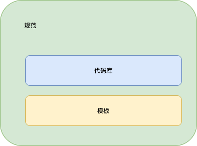
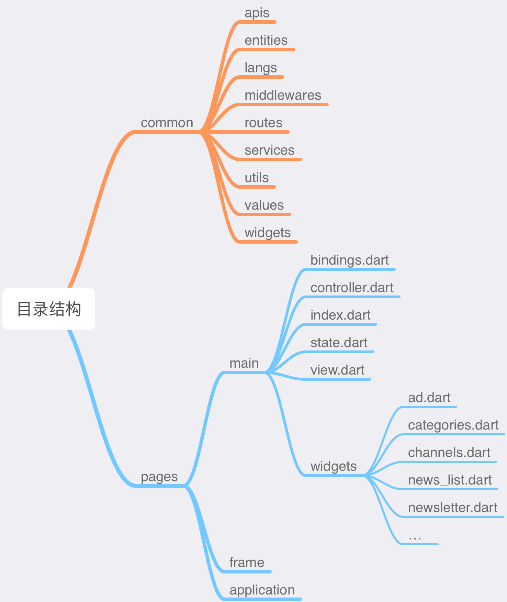

# flutter_ducafecat_news_getx

新闻客户端 Getx 版本 - 项目模板

> 你以为看到了结果，其实一切只是刚刚开始！


## B 站视频

https://space.bilibili.com/404904528/channel/detail?cid=177514&ctype=0

## 微信群 ducafecat

## 前言

我的这个代码主要不是为了完成业务，大家也看到了并没有很多业务。

这个项目是一个模板，有的同学可能要问，模板干啥的么~

## 如何提高代码质量+效率？



### 1. 规范

用习惯的方式去开发所有的项目，如：编码规范、目录规则、模型定义、布局方案。。。

[Effective Dart: Style](https://dart.dev/guides/language/effective-dart/style)

[Flutter_Go 代码开发规范.md](https://github.com/alibaba/flutter-go/blob/master/Flutter_Go%20%E4%BB%A3%E7%A0%81%E5%BC%80%E5%8F%91%E8%A7%84%E8%8C%83.md)

### 2. 模板

共性通用、常见的东西抽取出来，如：路由、全局数据、认证、鉴权、离线登录、接口管理、数据模型、程序升级、数据验证、三级缓存、错误收集、行为分析。。。

### 3. 代码库

这就是业务功能了，你可以都集中在一个单体的项目中（推荐），而不是很多包，不好管理。

常见业务有：欢迎界面、注册、登录、三方登录、聊天、视频、拍照、SKU、购物车、分销、地图、消息推送、评论、瀑布流、分类订阅、属性表格、轮播。。。

## 配套 vscode 插件

- [GetX Snippets](https://marketplace.visualstudio.com/items?itemName=get-snippets.get-snippets)

  必装 代码提示、代码块

- [Json to Dart Model](https://marketplace.visualstudio.com/items?itemName=hirantha.json-to-dart)

  支持空安全，推荐

- [Flutter GetX Generator - 猫哥](https://marketplace.visualstudio.com/items?itemName=ducafecat.getx-template)

  这个插件用来快速创建 `page` 代码，计划（json to dart、iconfont、test unit）

## 参考

- [get_cli](https://github.com/jonataslaw/get_cli)
- [getx_pattern](https://kauemurakami.github.io/getx_pattern/)
- [flutter-go](https://github.com/alibaba/flutter-go)
- [猫哥新闻第一版 flutter_learn_news](https://github.com/ducafecat/flutter_learn_news)
- [写夜子 flutter-getx-template](https://github.com/xieyezi/flutter-getx-template)
- [猫哥 getx_quick_start](https://github.com/ducafecat/getx_quick_start)
- [flutter_use](https://github.com/CNAD666/flutter_use)
- [redux part-1-overview-concepts](https://redux.js.org/tutorials/essentials/part-1-overview-concepts)
- [todo_getx](https://github.com/loicgeek/todo_getx)

## 目录结构



还是延续我第一版的目录结构，虽然 getx-cli 的目录也很简洁，但是我这个也没大问题。

### common 通用组件

| 名称        | 说明           |
| ----------- | -------------- |
| apis        | http 接口定义  |
| entities    | 数据模型、实例 |
| langs       | 多语言         |
| middlewares | 中间件         |
| routes      | 路由           |
| services    | getx 全局      |
| utils       | 工具           |
| values      | 值             |
| widgets     | 公共组件       |

### pages 业务界面


界面代码拆分也是继承了 redux 的设计思想，视图、动作、状态，进行拆分。

| 名称            | 说明     |
| --------------- | -------- |
| bindings.dart   | 数据绑定 |
| controller.dart | 控制器   |
| index.dart      | 入口     |
| state.dart      | 状态     |
| view.dart       | 视图     |
| widgets         | 组件     |

## GetX 上下拉列表界面


### `RxList` 来处理 List 集合

lib/pages/category/state.dart

```dart
class CategoryState {
  // 新闻翻页
  RxList<NewsItem> newsList = <NewsItem>[].obs;
}
```

### `StatefulWidget` 结合 `AutomaticKeepAliveClientMixin`

lib/pages/category/widgets/news_page_list.dart

```dart
class _NewsPageListState extends State<NewsPageList>
    with AutomaticKeepAliveClientMixin {
  @override
  bool get wantKeepAlive => true;

  final controller = Get.find<CategoryController>();

```

### `pull_to_refresh` 下拉组件

lib/pages/category/widgets/news_page_list.dart

```dart
  @override
  Widget build(BuildContext context) {
    super.build(context);
    return GetX<CategoryController>(
      init: controller,
      builder: (controller) => SmartRefresher(
        enablePullUp: true,
        controller: controller.refreshController,
        onRefresh: controller.onRefresh,
        onLoading: controller.onLoading,
        child: CustomScrollView(
          slivers: [
            SliverPadding(
              padding: EdgeInsets.symmetric(
                vertical: 0.w,
                horizontal: 0.w,
              ),
              sliver: SliverList(
                delegate: SliverChildBuilderDelegate(
                  (content, index) {
                    var item = controller.state.newsList[index];
                    return newsListItem(item);
                  },
                  childCount: controller.state.newsList.length,
                ),
              ),
            ),
          ],
        ),
      ),
    );
  }
```

`controller: controller.refreshController` 上下拉控制器

`onRefresh: controller.onRefresh` 下拉刷新数据

`onLoading: controller.onLoading` 上拉载入数据

`SliverChildBuilderDelegate` 动态构建每一项, `childCount` 告诉组件一共有多少数据

### `controller` 中写入业务

lib/pages/category/controller.dart

- `onRefresh` 下拉刷新

```dart
  void onRefresh() {
    fetchNewsList(isRefresh: true).then((_) {
      refreshController.refreshCompleted(resetFooterState: true);
    }).catchError((_) {
      refreshController.refreshFailed();
    });
  }
```

`refreshController.refreshCompleted()` 刷新完成

`refreshController.refreshFailed()` 刷新失败

- `onLoading` 上拉载入

```dart
  void onLoading() {
    if (state.newsList.length < total) {
      fetchNewsList().then((_) {
        refreshController.loadComplete();
      }).catchError((_) {
        refreshController.loadFailed();
      });
    } else {
      refreshController.loadNoData();
    }
  }
```

`refreshController.loadComplete()` 载入完成

`refreshController.loadFailed()` 载入失败

`refreshController.loadNoData()` 没有数据

- `fetch` 所有数据

```dart
  // 拉取数据
  Future<void> fetchNewsList({bool isRefresh = false}) async {
    var result = await NewsAPI.newsPageList(
      params: NewsPageListRequestEntity(
        categoryCode: categoryCode,
        pageNum: curPage + 1,
        pageSize: pageSize,
      ),
    );

    if (isRefresh == true) {
      curPage = 1;
      total = result.counts!;
      state.newsList.clear();
    } else {
      curPage++;
    }

    state.newsList.addAll(result.items!);
  }
```

`state.newsList.addAll(result.items!);` 合并 `list` 集合 `RxList` 封装的

- `dispose` 记得释放

```dart
  ///dispose 释放内存
  @override
  void dispose() {
    super.dispose();
    // dispose 释放对象
    refreshController.dispose();
  }
```

`refreshController.dispose()` 这个业务中就是下拉控件了，还有视频播放器、文本框啥的控制器都要记得释放。

- `bindings` 放在 `ApplicationBinding`

lib/pages/application/bindings.dart

```dart
class ApplicationBinding implements Bindings {
  @override
  void dependencies() {
    Get.lazyPut<ApplicationController>(() => ApplicationController());
    Get.lazyPut<MainController>(() => MainController());
    Get.lazyPut<CategoryController>(() => CategoryController());
  }
}
```

因为这个 `CategoryController` 是属于 `Application` 被路由载入的

## 状态管理

### `Bindings` 自动载入释放

适合命名路由

- 定义 `Bindings`

```dart
class SignInBinding implements Bindings {
  @override
  void dependencies() {
    Get.lazyPut<SignInController>(() => SignInController());
  }
}
```

- 路由定义

```dart
GetPage(
  name: AppRoutes.SIGN_IN,
  page: () => SignInPage(),
  binding: SignInBinding(),
),
```

- `Get.toNamed` 载入界面时自动管理响应数据

```sh
flutter: ** GOING TO ROUTE /home. isError: [false]
flutter: ** GOING TO ROUTE /count. isError: [false]
flutter: ** Instance "CountController" has been created. isError: [false]
flutter: ** Instance "CountController" has been initialized. isError: [false]
flutter: ** GOING TO ROUTE /count. isError: [false]
flutter: ** CLOSE TO ROUTE /count. isError: [false]
flutter: ** "CountController" onDelete() called. isError: [false]
flutter: ** "CountController" deleted from memory. isError: [false]
```

### `Get.put` `Get.find` 手动管理

适合非命名路由、组件实例化

- `Get.put` 初始

```dart
class StateDependencyPutFindView extends StatelessWidget {
  StateDependencyPutFindView({Key? key}) : super(key: key);

  final controller = Get.put<CountController>(CountController());
```

- `Get.find` 调用

```dart
class NextPageView extends StatelessWidget {
  NextPageView({Key? key}) : super(key: key);

  final controller = Get.find<CountController>();

  @override
  Widget build(BuildContext context) {
    return Scaffold(
      appBar: AppBar(
        title: Text("NextPage"),
      ),
      body: Center(
        child: Column(
          children: [
            GetX<CountController>(
              init: controller,
              initState: (_) {},
              builder: (_) {
                return Text('value -> ${_.count}');
              },
            ),
            Divider(),
          ],
        ),
      ),
    );
  }
}
```

## 组件设计

### 直接使用 `GetView` 组件

好处代码少，直接用 `controller` 成员变量访问

```dart
class HellowordWidget extends GetView<NotfoundController> {
  @override
  Widget build(BuildContext context) {
    return Center(
      child: Obx(() => Text(controller.state.title)),
    );
  }
}
```

### 遇到 `Mixin` 要自定义

使用 `Mixin with` 特性，直接 `StatefulWidget` `StatelessWidget` 封装

这是不可避免的

- AutomaticKeepAliveClientMixin

```dart
class _NewsPageListState extends State<NewsPageList>
    with AutomaticKeepAliveClientMixin {
  @override
  bool get wantKeepAlive => true;

  final controller = Get.find<CategoryController>();

  @override
  Widget build(BuildContext context) {
    super.build(context);
```

- TickerProviderStateMixin

```dart
class StaggerRoute extends StatefulWidget {
  @override
  _StaggerRouteState createState() => _StaggerRouteState();
}

class _StaggerRouteState extends State<StaggerRoute> with TickerProviderStateMixin {
  final controller = Get.find<StaggerController>();
```

### 不要响应数据过度使用

- 很多时候，你可能不需要响应数据

  - 单页面数据列表
  - 无夸页面、夸组件情况
  - 表单处理

- 推荐使用场景

  - 全局数据: 用户信息、聊天推送、样式色彩主题
  - 单页多组件交互：聊天界面
  - 多页面切换：购物车

> 请分清楚 `GetX` 是一种组件的封装方式，他只是包含了 `路由`、`状态管理`、`弹出框` ...

## 路由设计

## 全局数据

## 数据模型

## http 拉取数据

## 用户登录注销&401

## 动态权限

## APP 升级

## sentry 错误收集

## iconfont 矢量图标

## test 单元测试

## 埋点

## 数据缓存

## 样式全局配置

## 国际化

## GRAPHQL

## 数据加密安全

## 编译发布

## CICD

to be continued ...
